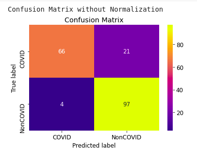
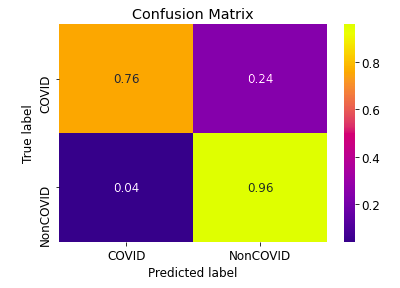
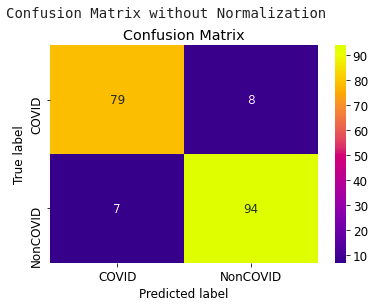
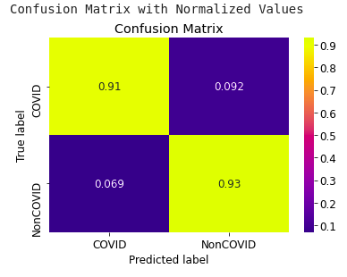

# Covid 19 Detection using Chest X-ray:

COVID-19 Detection based on Chest X-rays using two Transfer Learning algorithms: InceptionV3, Xception. The models were trained for 200 epochs on around 1000 Chest X-rays on Google Colab GPU. After training, the accuracies acheived for the model are as follows:

### For Xception:

  

### For InceptionV3:

 
 

# Dataset:

The dataset for the project was gathered from two sources:

1) Chest X-ray images (1000 images) were obtained from: https://github.com/ieee8023/covid-chestxray-dataset
